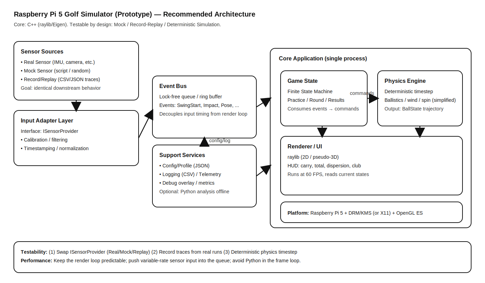

# Raspberry Pi 5 ゴルフシミュレータ（プロトタイプ）設計書（完全版）
— C++中心 / Mock・Record/Replayでテスト容易 / 安定描画（30〜60FPS）—

## 0. 概要

本書は Raspberry Pi 5 上で「ゴルフシミュレータもどき」を実装するための、**アーキテクチャ**・**モジュール設計**・**データ設計**・**テスト設計**・**実装ロードマップ**をまとめた設計書です。  
実センサー導入前でも開発を前に進められるよう、**Mock / Record / Replay** を最初から前提にします。

---

## 1. 目的とスコープ

### 1.1 目的
- Pi5上で **入力（まずはMock/Replay）→ 弾道計算 → 表示** を成立させる
- 実センサーが無くても回帰試験できる（Replayで再現性を担保）
- 入力の揺れ（可変レート）で描画が不安定にならない構造にする

### 1.2 MVP（まず実現する範囲）
- 練習モード（Practice）：1球打つ → 軌跡表示 → 結果表示（carry/total/左右）
- 表示：2Dトップビュー（必要なら疑似3D）
- 設定：JSON（クラブ、風、物理係数、描画設定）
- ログ：イベント・結果の保存（CSV/JSON）
- デバッグ：FPS / Queueドロップ数 / 状態表示

### 1.3 非スコープ（後回し）
- Unity/Unreal 等の重量級エンジン
- フル3Dコース、フォトリアル表示
- 公式弾道モデルの完全再現（MVPは簡易モデル）
- クラウド同期、対戦・ランキング

---

## 2. 要件

### 2.1 非機能要件（重要度高）
- フレーム：目標60FPS（最低30FPS安定）
- 入力：可変レート・欠損・遅延に耐える
- 再現性：同一トレースを再生したら同じ結果（許容誤差内）
- テスト：Mock/Replayで回帰試験が可能

### 2.2 機能要件（MVP）
- Shot（1打）の状態遷移
- 弾道計算（重力 + 抗力 + 風、必要なら簡易スピン）
- 軌跡描画（点列/線）と HUD（結果・設定・デバッグ）
- 設定読み込み（JSON）
- ログ出力（イベント・結果）

---

## 3. アーキテクチャ

### 3.1 主要方針
- **入力（可変）**と**描画（一定周期）**を **EventQueue** で分離
- 内部表現を `Event` に統一し、モジュール間を疎結合に
- 物理を **固定タイムステップ**（決定論）で更新し、Replayと相性良くする
- Pythonはフレームループに入れず、必要なら「分析」「補助」に限定

### 3.2 データフロー
1. `ISensorProvider` が `SensorFrame` を供給（Real/Mock/Replay）
2. `InputAdapter` が正規化・フィルタ・検出して `Event` を生成
3. `EventQueue` に push（入力揺れを吸収）
4. メインループがキューを drain
5. `GameStateMachine` が状態遷移し、物理へコマンド発行
6. `PhysicsEngine` が固定dtで弾道更新、結果算出、軌跡保持
7. `Renderer` が状態を描画（HUD + 軌跡）

### 3.3 アーキテクチャ図


---

## 4. プロセス/スレッド方針

### 4.1 推奨（段階的に）
- **Phase 1（最速で動く）**：単一スレッド（入力pollはnon-blockingで複数回）
- **Phase 2（必要なら）**：入力スレッドを分離（EventQueueへpush、メインがpop）

最初は Phase 1 で十分。実センサー導入で入力がブロック/高頻度になったら Phase 2 に移行。

---

## 5. ディレクトリ/モジュール構成（提案）

```text
golf-sim/
  CMakeLists.txt
  assets/
    fonts/
    course/
  config/
    sim.json
    clubs.json
  include/
    app/App.hpp
    input/ISensorProvider.hpp
    input/MockSensorProvider.hpp
    input/ReplaySensorProvider.hpp
    input/RealSensorProvider.hpp
    input/InputAdapter.hpp
    input/Detector.hpp
    core/Event.hpp
    core/EventQueue.hpp
    game/GameStateMachine.hpp
    physics/PhysicsEngine.hpp
    physics/BallState.hpp
    physics/Trajectory.hpp
    render/Renderer.hpp
    util/Config.hpp
    util/Logger.hpp
    util/Time.hpp
  src/
    main.cpp
    app/App.cpp
    input/MockSensorProvider.cpp
    input/ReplaySensorProvider.cpp
    input/InputAdapter.cpp
    input/Detector.cpp
    core/EventQueue.cpp
    game/GameStateMachine.cpp
    physics/PhysicsEngine.cpp
    render/Renderer.cpp
    util/Config.cpp
    util/Logger.cpp
  tests/
    test_physics.cpp
    test_replay.cpp
  traces/
    swing01.csv
    swing02.csv
```

---

## 6. データ設計（構造体/型）

### 6.1 SensorFrame（入力の最小表現）
```cpp
struct SensorFrame {
  double t_sec;        // monotonic time [s]
  float ax, ay, az;    // acceleration
  float gx, gy, gz;    // gyro
  // optional:
  // float qw, qx, qy, qz; // orientation quaternion
};
```

### 6.2 Event（内部共通言語）
```cpp
enum class EventType {
  Pose,        // IMU sample / pose update
  SwingStart,  // swing detected
  Impact,      // impact detected
  SwingEnd     // swing finished
};

struct Event {
  EventType type;
  double t_sec;
  SensorFrame frame;   // MVPは集約でOK（将来variant化も可）
};
```

### 6.3 BallState（物理状態）
```cpp
struct BallState {
  double t_sec;
  Vec3 pos;   // m
  Vec3 vel;   // m/s
  Vec3 spin;  // simplified
  bool in_flight;
};
```

### 6.4 ShotResult（結果）
```cpp
struct ShotResult {
  double carry_m;
  double total_m;
  double lateral_m;     // +右 / -左（運用で統一）
  double flight_time_s;
};
```

---

## 7. 入力差し替え（Mock/Replay/Real）

### 7.1 ISensorProvider（最重要インタフェース）
- `poll()` は **non-blocking**
- 入力が取れない場合は false（描画やゲームループを止めない）

```cpp
class ISensorProvider {
public:
  virtual ~ISensorProvider() = default;
  virtual bool poll(SensorFrame& out) = 0; // non-blocking
};
```

### 7.2 MockSensorProvider（開発初期の主力）
- シナリオ駆動（basic/slice/hook/high/low 等）
- ノイズは seed 固定で再現性確保
- MVPは「Impactをシナリオから直接発火」でもOK（最速で実装が進む）

CLI例：
```bash
./golf-sim --sensor=mock --scenario=basic --seed=42
```

### 7.3 ReplaySensorProvider（回帰試験の主力）
- CSV/JSONトレース読み込み
- 2モード推奨
  - sync：t_secに合わせて供給（実時間）
  - fast：時間同期せず順に供給（高速回帰）

CLI例：
```bash
./golf-sim --sensor=replay --trace=traces/swing01.csv
./golf-sim --sensor=replay --trace=traces/swing01.csv --replay-fast
```

### 7.4 Record（実機導入後）
- RealSensorProviderの出力（SensorFrame）を **Replay互換形式**で保存
- 「記録できる＝バグを捕まえられる」ので最初から設計に含める

---

## 8. InputAdapter / Detector（検出ロジックの隔離）

### 8.1 InputAdapterの責務
- 単位/座標系の正規化（必要なら）
- フィルタ（LPF/移動平均）
- Detectorへ渡して SwingStart/Impact を判定
- `Event` を生成し EventQueueへ

### 8.2 Detectorの責務（差し替えポイント）
- MVP：閾値ベース（ルールベース）
- 将来：姿勢推定や学習に置換可能な形で分離

検出例（イメージ）：
- SwingStart：|gyro| > threshold
- Impact：|accel| のピーク（または微分が閾値超え）

※MVPは「MockがImpactを直接出す」でも良い。Detectorは後から実装でOK。

---

## 9. EventQueue（入力と描画の分離）

### 9.1 要件
- SPSCリングバッファ推奨（軽量）
- 溢れ時の方針（推奨：最新優先）
  - `DropOldest`：古いEventを捨てて最新を入れる
- ドロップ数をメトリクス化（HUD・ログ表示）

### 9.2 API例
```cpp
class EventQueue {
public:
  bool push(const Event& e);
  bool pop(Event& out);
  size_t size() const;
  size_t dropped() const;
};
```

---

## 10. GameStateMachine（FSM仕様）

### 10.1 状態
- Idle：待機
- Armed：スイング待ち
- InFlight：飛行中（物理更新）
- Result：結果表示

### 10.2 遷移（最小）
- Idle → Armed：ボタンまたは姿勢安定
- Armed → InFlight：ImpactイベントでShot開始
- InFlight → Result：着地判定（pos.z <= 0）
- Result → Armed：ボタン or タイムアウト

---

## 11. PhysicsEngine（固定dt・決定論）

### 11.1 固定dtの採用理由
- Replayで結果がブレにくい
- FPS変動の影響が物理に乗りにくい
- 回帰試験が容易

### 11.2 accumulator方式
```cpp
void PhysicsEngine::step(double dt_real) {
  acc_ += dt_real;
  while (acc_ >= dt_fixed_) {
    integrate(dt_fixed_);
    acc_ -= dt_fixed_;
  }
}
```

### 11.3 MVPの弾道モデル（簡易）
- 重力：g
- 風：v_rel = v - wind
- 抗力（簡易）：F_d = -k_d * |v_rel| * v_rel
- （任意）スピン：Magnusを簡易係数で（MVPでは省略可）

MVPは「重力＋抗力＋風」だけでも十分"それっぽい"。

---

## 12. Renderer/UI（raylib）

### 12.1 表示要素（MVP）
- コース：2D平面（フェアウェイ形状、距離グリッド）
- ボール：現在位置
- 軌跡：ポリライン（最大点数制限、間引き）
- HUD：carry/total/lateral、クラブ、風、FPS、状態、ドロップ数

### 12.2 性能対策（Pi向け）
- 軌跡点数制限（例：2000点）
- 一定距離/一定時間ごとに点追加して間引き
- ログは毎フレーム出さずイベント単位に

---

## 13. 設定（JSON）仕様

### 13.1 sim.json（例）
```json
{
  "physics": {
    "dt_fixed_hz": 240,
    "gravity": 9.80665,
    "drag_k": 0.02,
    "wind": [1.0, 0.0, 0.0]
  },
  "render": {
    "fps_limit": 60,
    "max_trail_points": 2000,
    "show_debug": true
  },
  "input": {
    "impact_acc_threshold": 18.0,
    "swing_gyro_threshold": 3.0
  }
}
```

### 13.2 clubs.json（例：MVPの暫定）
```json
{
  "driver": { "launch_deg": 12.0, "speed_mps": 68.0, "spin": 200.0 },
  "iron7":  { "launch_deg": 18.0, "speed_mps": 45.0, "spin": 450.0 }
}
```

---

## 14. ログ仕様

### 14.1 events.csv（Replay互換を意識）
```text
t,type,ax,ay,az,gx,gy,gz
0.000,Pose,0.01,0.02,9.80,0.001,0.002,0.003
0.520,SwingStart, ...
0.680,Impact, ...
```

### 14.2 result.json（例）
```json
{
  "shot_id": "2025-12-15T22:10:01",
  "carry_m": 210.4,
  "total_m": 224.8,
  "lateral_m": 12.2,
  "flight_time_s": 5.7,
  "club": "driver",
  "wind": [1.0, 0.0, 0.0]
}
```

---

## 15. メインループ（推奨擬似コード）

```cpp
auto sensor = MakeSensorProvider(cfg);  // mock/real/replay
InputAdapter adapter(cfg);
EventQueue q;

GameStateMachine gsm(cfg);
PhysicsEngine phys(cfg);
Renderer renderer(cfg);
Logger logger(cfg);

double last = nowSec();

while (!renderer.shouldClose()) {
  double t = nowSec();
  double dt = t - last;
  last = t;

  // 1) Input polling (non-blocking)
  SensorFrame f;
  while (sensor->poll(f)) {
    Event ev;
    if (adapter.toEvent(f, ev)) {
      q.push(ev);
    }
  }

  // 2) Drain events
  Event ev;
  while (q.pop(ev)) {
    gsm.onEvent(ev, phys);     // Impact等でShot開始コマンド
    logger.writeEvent(ev);
  }

  // 3) Physics (fixed timestep)
  phys.step(dt);

  // 4) Render
  renderer.draw(gsm, phys, q); // qからdropped等のデバッグ表示
}
```

---

## 16. CLI（提案）

- `--sensor=mock|replay|real`
- `--scenario=<name>`（mock用）
- `--trace=<file>`（replay用）
- `--seed=<int>`（mock用）
- `--config-sim=<file>`
- `--config-clubs=<file>`
- `--replay-fast`（時間同期しない）
- `--headless`（描画なし：CI/ベンチ）

例：
```bash
./golf-sim --sensor=mock --scenario=basic --seed=42
./golf-sim --sensor=replay --trace=traces/swing01.csv --replay-fast
```

---

## 17. テスト戦略（MVPに必須）

### 17.1 単体テスト（Physics）
- 入力（初速/角度/風）→ carryが期待範囲
- 単調性チェック（drag増→距離減）

### 17.2 結合テスト（Replay）
- 同一トレース → 同一結果（許容誤差内）
- FPS平均、最大フレーム時間(ms)を記録し退行検知

---

## 18. 例外系・デバッグ（運用で効く）
- Queue溢れ：ドロップ数をHUD表示し、ログにも残す
- Replay破損：行スキップしてエラー数表示（停止しない）
- FPS低下：軌跡点数制限・HUD削減・ログ頻度低下

---

## 19. 実装ロードマップ（推奨）

### Phase 1：とにかく動かす（1〜2日目想定）
- Mock入力（Impact直発火でOK）
- Physics（重力+抗力+風）
- 2D表示（軌跡+HUD）

### Phase 2：回帰試験を回す（次）
- 設定JSON
- events.csv / result.json ログ
- Replay（sync/fast）

### Phase 3：ゲーム要素の充実
- FSM（Idle/Armed/InFlight/Result）
- 練習モード完成（UI・操作）

### Phase 4：実センサー導入
- RealSensorProvider
- Detector実装（Impact/SwingStartの精度向上）
- Record → Replayで再現性維持

---

## 20. 実装開始のために確定すべき仕様（最小）
- 表示：2Dトップビューで開始する（推奨）
- Impact：MVPはMockでイベント直発火（推奨）
- 弾道：MVPは「重力＋抗力＋風」で開始（推奨）

これで、最小実装（CMake + raylib + Mock/Replay + Physics + HUD）をそのままコード雛形として落とせます。
